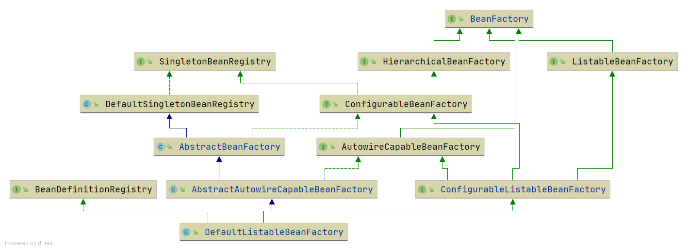

 # IOC
 ## 最简单的bean容器
 > 分支：simple-bean-container

定义一个简单的bean容器BeanFactory，内部包含一个map用以保存bean，只有注册bean和获取bean两个方法
```
public class BeanFactory {
	private Map<String, Object> beanMap = new HashMap<>();

	public void registerBean(String name, Object bean) {
		beanMap.put(name, bean);
	}

	public Object getBean(String name) {
		return beanMap.get(name);
	}
}
```

测试：
```
public class SimpleBeanContainerTest {

	@Test
	public void testGetBean() throws Exception {
		BeanFactory beanFactory = new BeanFactory();
		beanFactory.registerBean("helloService", new HelloService());
		HelloService helloService = (HelloService) beanFactory.getBean("helloService");
		assertThat(helloService).isNotNull();
		assertThat(helloService.sayHello()).isEqualTo("hello");
	}

	class HelloService {
		public String sayHello() {
			System.out.println("hello");
			return "hello";
		}
	}
}
```

## BeanDefinition和BeanDefinitionRegistry
> 分支：bean-definition-and-bean-definition-registry

主要增加如下类：
- BeanDefinition，顾名思义，用于定义bean信息的类，包含bean的class类型、构造参数、属性值等信息，每个bean对应一个BeanDefinition的实例。简化BeanDefition仅包含bean的class类型。
- BeanDefinitionRegistry，BeanDefinition注册表接口，定义注册BeanDefintion的方法。
- SingletonBeanRegistry及其实现类DefaultSingletonBeanRegistry，定义添加和获取单例bean的方法。

bean容器作为BeanDefinitionRegistry和SingletonBeanRegistry的实现类，具备两者的能力。向bean容器中注册BeanDefintion后，使用bean时才会实例化。


测试：
```
public class BeanDefinitionAndBeanDefinitionRegistryTest {

	@Test
	public void testBeanFactory() throws Exception {
		DefaultListableBeanFactory beanFactory = new DefaultListableBeanFactory();
		BeanDefinition beanDefinition = new BeanDefinition(HelloService.class);
		beanFactory.registerBeanDefinition("helloService", beanDefinition);

		HelloService helloService = (HelloService) beanFactory.getBean("helloService");
		helloService.sayHello();
	}
}

class HelloService {
	public String sayHello() {
		System.out.println("hello");
		return "hello";
	}
}
```

## Bean实例化策略InstantiationStrategy
> 分支：instantiation-strategy

现在bean是在AbstractAutowireCapableBeanFactory.doCreateBean方法中用beanClass.newInstance()来实例化，仅适用于bean有无参构造函数的情况。


针对bean的实例化，抽象出一个实例化策略的接口InstantiationStrategy，有两个实现类：
- SimpleInstantiationStrategy，使用bean的构造函数来实例化
- CglibSubclassingInstantiationStrategy，使用CGLIB动态生成子类

## 为bean填充属性
> 分支：populate-bean-with-property-values

在BeanDefinition中增加和bean属性对应的PropertyValues，实例化bean之后，为bean填充属性(AbstractAutowireCapableBeanFactory#applyPropertyValues)。

测试：
```
public class PopulateBeanWithPropertyValuesTest {

	@Test
	public void testPopulateBeanWithPropertyValues() throws Exception {
		DefaultListableBeanFactory beanFactory = new DefaultListableBeanFactory();
		PropertyValues propertyValues = new PropertyValues();
		propertyValues.addPropertyValue(new PropertyValue("name", "derek"));
		propertyValues.addPropertyValue(new PropertyValue("age", 18));
		BeanDefinition beanDefinition = new BeanDefinition(Person.class, propertyValues);
		beanFactory.registerBeanDefinition("person", beanDefinition);

		Person person = (Person) beanFactory.getBean("person");
		System.out.println(person);
		assertThat(person.getName()).isEqualTo("derek");
		assertThat(person.getAge()).isEqualTo(18);
	}
}
```

## 为bean注入bean
> 分支：populate-bean-with-bean

增加BeanReference类，包装一个bean对另一个bean的引用。实例化beanA后填充属性时，若PropertyValue#value为BeanReference，引用beanB，则先去实例化beanB。
由于不想增加代码的复杂度提高理解难度，暂时不支持循环依赖，后面会在高级篇中解决该问题。
```
protected void applyPropertyValues(String beanName, Object bean, BeanDefinition beanDefinition) {
    try {
        for (PropertyValue propertyValue : beanDefinition.getPropertyValues().getPropertyValues()) {
            String name = propertyValue.getName();
            Object value = propertyValue.getValue();
            if (value instanceof BeanReference) {
                // beanA依赖beanB，先实例化beanB
                BeanReference beanReference = (BeanReference) value;
                value = getBean(beanReference.getBeanName());
            }

            //通过反射设置属性
            BeanUtil.setFieldValue(bean, name, value);
        }
    } catch (Exception ex) {
        throw new BeansException("Error setting property values for bean: " + beanName, ex);
    }
}
```

测试：
```
public class PopulateBeanWithPropertyValuesTest {

	/**
	 * 为bean注入bean
	 *
	 * @throws Exception
	 */
	@Test
	public void testPopulateBeanWithBean() throws Exception {
		DefaultListableBeanFactory beanFactory = new DefaultListableBeanFactory();

		//注册Car实例
		PropertyValues propertyValuesForCar = new PropertyValues();
		propertyValuesForCar.addPropertyValue(new PropertyValue("brand", "porsche"));
		BeanDefinition carBeanDefinition = new BeanDefinition(Car.class, propertyValuesForCar);
		beanFactory.registerBeanDefinition("car", carBeanDefinition);

		//注册Person实例
		PropertyValues propertyValuesForPerson = new PropertyValues();
		propertyValuesForPerson.addPropertyValue(new PropertyValue("name", "derek"));
		propertyValuesForPerson.addPropertyValue(new PropertyValue("age", 18));
		//Person实例依赖Car实例
		propertyValuesForPerson.addPropertyValue(new PropertyValue("car", new BeanReference("car")));
		BeanDefinition beanDefinition = new BeanDefinition(Person.class, propertyValuesForPerson);
		beanFactory.registerBeanDefinition("person", beanDefinition);

		Person person = (Person) beanFactory.getBean("person");
		System.out.println(person);
		assertThat(person.getName()).isEqualTo("derek");
		assertThat(person.getAge()).isEqualTo(18);
		Car car = person.getCar();
		assertThat(car).isNotNull();
		assertThat(car.getBrand()).isEqualTo("porsche");
	}
}
```

## 资源和资源加载器
> 分支：resource-and-resource-loader

Resource是资源的抽象和访问接口，简单写了三个实现类


- FileSystemResource，文件系统资源的实现类
- ClassPathResource，classpath下资源的实现类
- UrlResource，对java.net.URL进行资源定位的实现类

ResourceLoader接口则是资源查找定位策略的抽象，DefaultResourceLoader是其默认实现类

测试：
```
public class ResourceAndResourceLoaderTest {

	@Test
	public void testResourceLoader() throws Exception {
		DefaultResourceLoader resourceLoader = new DefaultResourceLoader();

		//加载classpath下的资源
		Resource resource = resourceLoader.getResource("classpath:hello.txt");
		InputStream inputStream = resource.getInputStream();
		String content = IoUtil.readUtf8(inputStream);
		System.out.println(content);
		assertThat(content).isEqualTo("hello world");

		//加载文件系统资源
		resource = resourceLoader.getResource("src/test/resources/hello.txt");
		assertThat(resource instanceof FileSystemResource).isTrue();
		inputStream = resource.getInputStream();
		content = IoUtil.readUtf8(inputStream);
		System.out.println(content);
		assertThat(content).isEqualTo("hello world");

		//加载url资源
		resource = resourceLoader.getResource("https://www.baidu.com");
		assertThat(resource instanceof UrlResource).isTrue();
		inputStream = resource.getInputStream();
		content = IoUtil.readUtf8(inputStream);
		System.out.println(content);
	}
}
```

## 在xml文件中定义bean
> 分支：xml-file-define-bean

有了资源加载器，就可以在xml格式配置文件中声明式地定义bean的信息，资源加载器读取xml文件，解析出bean的信息，然后往容器中注册BeanDefinition。

BeanDefinitionReader是读取bean定义信息的抽象接口，XmlBeanDefinitionReader是从xml文件中读取的实现类。BeanDefinitionReader需要有获取资源的能力，且读取bean定义信息后需要往容器中注册BeanDefinition，因此BeanDefinitionReader的抽象实现类AbstractBeanDefinitionReader拥有ResourceLoader和BeanDefinitionRegistry两个属性。

由于从xml文件中读取的内容是String类型，所以属性仅支持String类型和引用其他Bean。后面会讲到属性编辑器PropertyEditor，实现类型转换。

为了方便后面的讲解和功能实现，并且尽量保持和spring中BeanFactory的继承层次一致，对BeanFactory的继承层次稍微做了调整，增加了接口ConfigurableListableBeanFactory和ListableBeanFactory和对应的方法，方法在DefaultListableBeanFactory中实现。



测试：
bean定义文件spring.xml
```
<?xml version="1.0" encoding="UTF-8"?>
<beans xmlns="http://www.springframework.org/schema/beans"
       xmlns:xsi="http://www.w3.org/2001/XMLSchema-instance"
       xmlns:context="http://www.springframework.org/schema/context"
       xsi:schemaLocation="http://www.springframework.org/schema/beans
	         http://www.springframework.org/schema/beans/spring-beans.xsd
		 http://www.springframework.org/schema/context
		 http://www.springframework.org/schema/context/spring-context-4.0.xsd">

    <bean id="person" class="org.springframework.test.ioc.bean.Person">
        <property name="name" value="derek"/>
        <property name="car" ref="car"/>
    </bean>

    <bean id="car" class="org.springframework.test.ioc.bean.Car">
        <property name="brand" value="porsche"/>
    </bean>

</beans>
```

```
public class XmlFileDefineBeanTest {

	@Test
	public void testXmlFile() throws Exception {
		DefaultListableBeanFactory beanFactory = new DefaultListableBeanFactory();
		XmlBeanDefinitionReader beanDefinitionReader = new XmlBeanDefinitionReader(beanFactory);
		beanDefinitionReader.loadBeanDefinitions("classpath:spring.xml");

		Person person = (Person) beanFactory.getBean("person");
		System.out.println(person);
		assertThat(person.getName()).isEqualTo("derek");
		assertThat(person.getCar().getBrand()).isEqualTo("porsche");

		Car car = (Car) beanFactory.getBean("car");
		System.out.println(car);
		assertThat(car.getBrand()).isEqualTo("porsche");
	}
}
```

## BeanFactoryPostProcess和BeanPostProcessor
> 分支：bean-factory-post-processor-and-bean-post-processor

BeanFactoryPostProcess和BeanPostProcessor是spring框架中具有重量级地位的两个接口，理解了这两个接口的作用，基本就理解spring的核心原理了。为了降低理解难度分两个小节实现。

BeanFactoryPostProcessor是spring提供的容器扩展机制，允许我们在bean实例化之前修改bean的定义信息即BeanDefinition的信息。其重要的实现类有PropertyPlaceholderConfigurer和CustomEditorConfigurer，PropertyPlaceholderConfigurer的作用是用properties文件的配置值替换xml文件中的占位符，CustomEditorConfigurer的作用是实现类型转换。BeanFactoryPostProcessor的实现比较简单，看单元测试BeanFactoryPostProcessorAndBeanPostProcessorTest#testBeanFactoryPostProcessor追下代码。

BeanPostProcessor也是spring提供的容器扩展机制，不同于BeanFactoryPostProcessor的是，BeanPostProcessor在bean实例化后修改bean或替换bean。BeanPostProcessor是后面实现AOP的关键。

BeanPostProcessor的两个方法分别在bean执行初始化方法（后面实现）之前和之后执行，理解其实现重点看单元测试BeanFactoryPostProcessorAndBeanPostProcessorTest#testBeanPostProcessor和AbstractAutowireCapableBeanFactory#initializeBean方法，有些地方做了微调，可不必关注。

```
public interface BeanPostProcessor {
	/**
	 * 在bean执行初始化方法之前执行此方法
	 */
	Object postProcessBeforeInitialization(Object bean, String beanName) throws BeansException;

	/**
	 * 在bean执行初始化方法之后执行此方法
	 */
	Object postProcessAfterInitialization(Object bean, String beanName) throws BeansException;
}
```

下一节将引入ApplicationContext，能自动识别BeanFactoryPostProcessor和BeanPostProcessor，就可以在xml文件中配置而不需要手动添加到BeanFactory了。

测试：
```
public class BeanFactoryProcessorAndBeanPostProcessorTest {

	@Test
	public void testBeanFactoryPostProcessor() throws Exception {
		DefaultListableBeanFactory beanFactory = new DefaultListableBeanFactory();
		XmlBeanDefinitionReader beanDefinitionReader = new XmlBeanDefinitionReader(beanFactory);
		beanDefinitionReader.loadBeanDefinitions("classpath:spring.xml");

		//在所有BeanDefintion加载完成后，但在bean实例化之前，修改BeanDefinition的属性值
		CustomBeanFactoryPostProcessor beanFactoryPostProcessor = new CustomBeanFactoryPostProcessor();
		beanFactoryPostProcessor.postProcessBeanFactory(beanFactory);

		Person person = (Person) beanFactory.getBean("person");
		System.out.println(person);
		//name属性在CustomBeanFactoryPostProcessor中被修改为ivy
		assertThat(person.getName()).isEqualTo("ivy");
	}

	@Test
	public void testBeanPostProcessor() throws Exception {
		DefaultListableBeanFactory beanFactory = new DefaultListableBeanFactory();
		XmlBeanDefinitionReader beanDefinitionReader = new XmlBeanDefinitionReader(beanFactory);
		beanDefinitionReader.loadBeanDefinitions("classpath:spring.xml");

		//添加bean实例化后的处理器
		CustomerBeanPostProcessor customerBeanPostProcessor = new CustomerBeanPostProcessor();
		beanFactory.addBeanPostProcessor(customerBeanPostProcessor);

		Car car = (Car) beanFactory.getBean("car");
		System.out.println(car);
		//brand属性在CustomerBeanPostProcessor中被修改为lamborghini
		assertThat(car.getBrand()).isEqualTo("lamborghini");
	}
}
```


